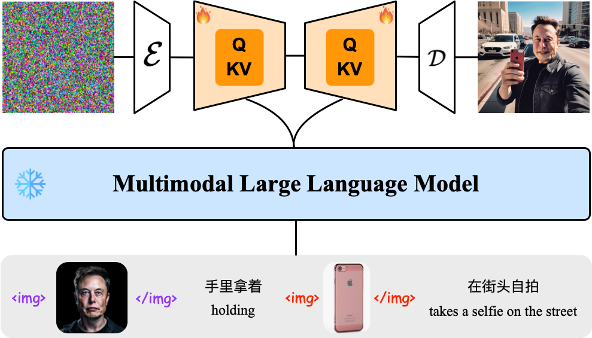
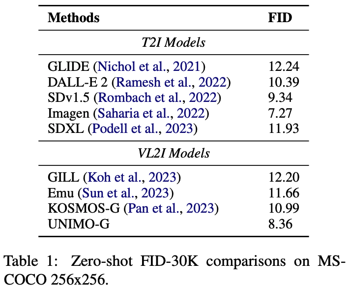
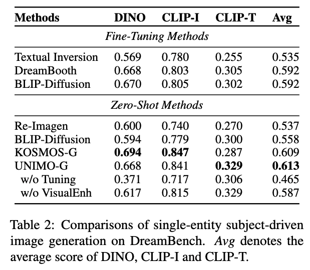
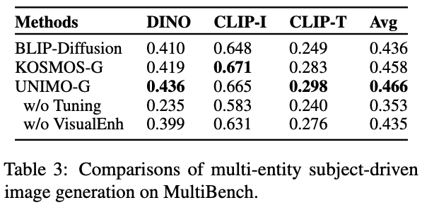

## [UNIMO-G: Unified Image Generation through Multimodal Conditional Diffusion](https://arxiv.org/pdf/2401.13388.pdf)

## Abstract
Existing text-to-image diffusion models primarily generate images from text prompts. However, the inherent conciseness of textual descriptions poses challenges in faithfully synthesizing images with intricate details, such as specific entities or scenes. This paper presents \textbf{UNIMO-G}, a simple multimodal conditional diffusion framework that operates on multimodal prompts with interleaved textual and visual inputs, which demonstrates a unified ability for both text-driven and subject-driven image generation. UNIMO-G comprises two core components: a Multimodal Large Language Model (MLLM) for encoding multimodal prompts, and a conditional denoising diffusion network for generating images based on the encoded multimodal input. We leverage a two-stage training strategy to effectively train the framework: firstly pre-training on large-scale text-image pairs to develop conditional image generation capabilities, and then instruction tuning with multimodal prompts to achieve unified image generation proficiency. A well-designed data processing pipeline involving language grounding and image segmentation is employed to construct multi-modal prompts. UNIMO-G excels in both text-to-image generation and zero-shot subject-driven synthesis, and is notably effective in generating high-fidelity images from complex multimodal prompts involving multiple image entities.

## Cases

## Quantitative Comparison
Results on text-to-image generation:

Results on zero-shot single-entity subject-driven generation:

Results on zero-shot multi-entity subject-driven generation:

## Qualitative Comparison
Comparison with baselines for zero-shot multi-entity subject-driven image generation on MultiBench:

---